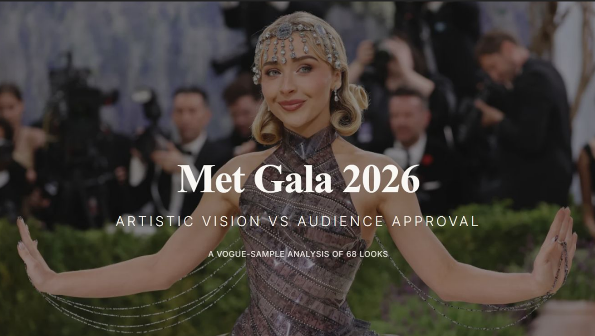

# Met Gala 2026 Fashion Analysis

A fashion data analysis case study exploring the relationship between artistic theme fit and public approval at the Met Gala 2026.

## Project Overview

This project analyzes a curated sample of 68 Met Gala 2026 looks featured in Vogue’s best-dressed coverage. The analysis explores how selected looks translated the event’s artistic theme into fashion and whether stronger theme interpretation aligned with higher public approval.

The project was built as a manual data analysis and visual storytelling case study using Excel and Figma.

## Research Question

Do stronger artistic interpretations of the Met Gala 2026 theme align with higher public approval?

## Dataset

The dataset was manually created rather than downloaded.

Each record represents one Vogue-featured look and includes:

- Celebrity
- Fashion house
- Designer
- Gender presentation
- Primary color
- Secondary color
- Silhouette
- Look category
- Material or texture
- Theme interpretation
- Theme fit
- Art reference
- Best dressed status based on public approval
- Rating
- Vote “Yes” percentage
- Media source
- Notes

## Methodology

The data was manually extracted from Vogue’s Met Gala 2026 best-dressed coverage and structured in Excel.

Additional visual and conceptual variables were manually classified through outfit review, including color group, silhouette, material or texture, theme interpretation, theme fit, and art reference.

Excel was used for:

- Data cleaning
- Category standardization
- Pivot tables
- Chart creation
- Exploratory analysis

Figma was used to design the final editorial-style presentation deck.

## Key Findings

- Stronger theme fit generally aligned with higher public approval.
- Looks rated Very high in theme fit had the highest average public “Yes” vote percentage.
- Black was the dominant primary color group in the analyzed sample.
- Saint Laurent and Thom Browne were the most represented fashion houses.
- Several highly thematic looks still received under 50% public approval, showing that strong artistic concept did not always guarantee popular taste.

## Tools Used

- Microsoft Excel
- Figma
- Manual data collection
- Data cleaning
- Pivot tables
- Data visualization
- Editorial presentation design

## Limitations

This project is based on a curated Vogue sample, not the full Met Gala guest list.

Several variables, including theme fit, look category, material or texture, theme interpretation, and art reference, were manually classified. These categories involve subjective judgment and should be interpreted as part of an editorial data analysis.

Public approval is based on available Vogue “Yes” vote percentages and does not represent universal public opinion.

## Project Files

- `data/` — cleaned dataset and Excel workbook
- `presentation/` — final case study PDF
- `visuals/` — exported presentation screenshots and chart visuals

## Final Takeaway

Fashion data reveals not only what people wore, but how audiences responded to art, identity, and spectacle.
